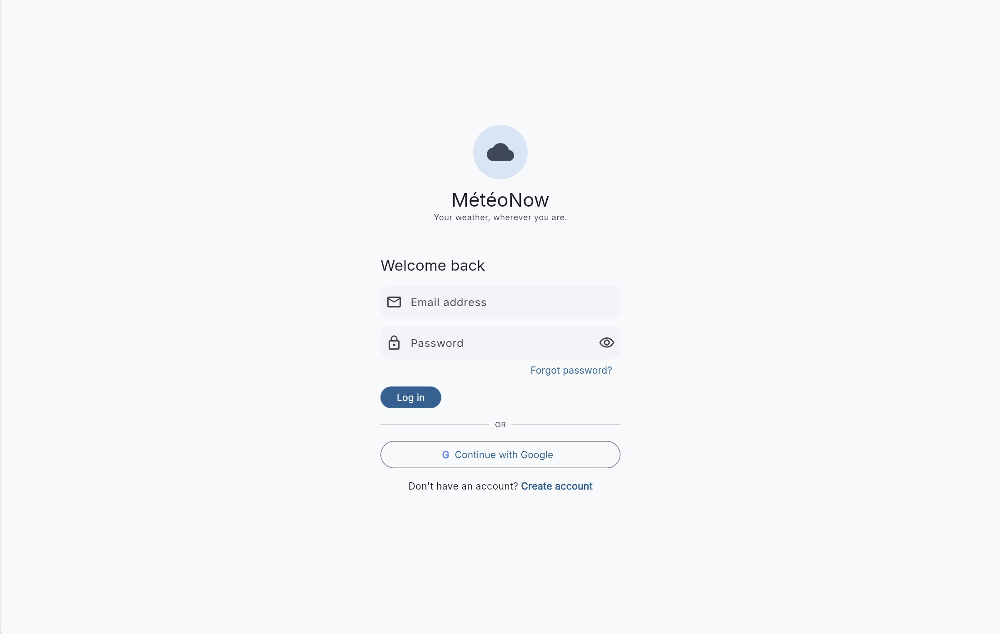
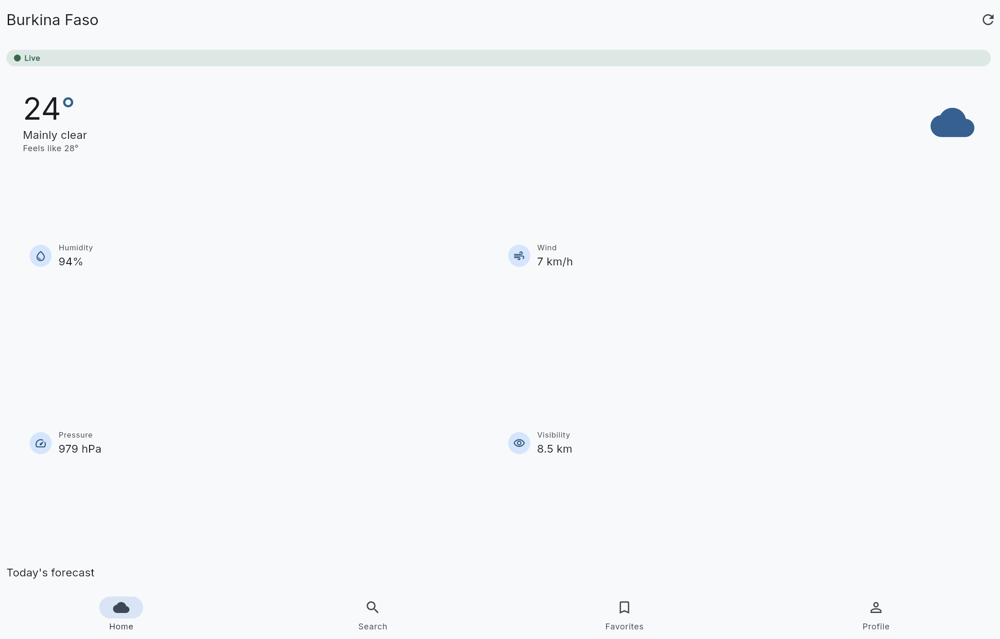
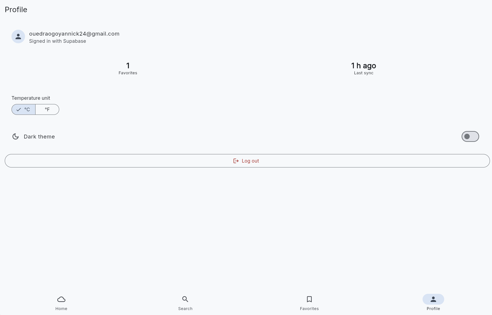

# MétéoNow

A weather app with real authentication, offline caching, and a synced favorites list — built for the NextFlutter "Connected app with real backend" certification.

## Features

- Email/password and Google sign-in (Supabase Auth), with account creation and logout
- Live weather and 5-day/hourly forecasts for any city (Open-Meteo)
- City search with debounced geocoding lookup
- Favorite locations synced to your account, with offline fallback when there's no network
- °C/°F and light/dark theme preferences, persisted locally

## Screenshots

| Login | Home | Profile |
|---|---|---|
|  |  |  |

## Architecture

```text
lib/
├── main.dart                 # bootstrap: Hive, Supabase, dependency wiring
├── core/
│   ├── network/               # Dio clients: plain (Open-Meteo), intercepted (Supabase REST)
│   ├── cache/                 # Hive box setup
│   ├── theme/                 # Material theme from the Stitch design tokens
│   ├── router/                # GoRouter: auth-gated redirect, shell, DI scope
│   ├── config/                 # --dart-define-based Supabase credentials
│   └── errors/                 # Result<T>/Failure — every repository returns one, never throws
└── features/
    ├── auth/        {data, domain, presentation}  # Supabase-backed login/register/logout
    ├── weather/      {data, domain, presentation}  # Open-Meteo + Hive offline cache
    ├── favorites/    {data, domain, presentation}  # Supabase REST (via AuthInterceptor) + Hive mirror
    └── profile/      {data, domain, presentation}  # local settings (theme, units)
```

Feature-First + Clean Architecture: each feature has its own `data` (API/Hive/Supabase access), `domain` (entities + repository interfaces), and `presentation` (screens/controllers) layer.

## APIs used

- **[Open-Meteo](https://open-meteo.com)** — free, no API key required. Used for current conditions, hourly/daily forecasts (`/v1/forecast`), and city search (`geocoding-api.open-meteo.com/v1/search`).
- **[Supabase](https://supabase.com)** — authentication (email/password + Google OAuth) via `supabase_flutter`, and a `favorites` Postgres table (Row Level Security restricts each user to their own rows), accessed through a hand-rolled Dio client with an `AuthInterceptor` that injects the current JWT and retries once after refreshing an expired session on a 401.

## Configuration

This app needs a Supabase project before it can run. See `docs/superpowers/specs/2026-10-03-meteonow-app-design.md` and `supabase/favorites.sql` for the full rationale; the short version:

1. Create a project at [supabase.com](https://supabase.com).
2. In the SQL Editor, run `supabase/favorites.sql`.
3. Copy `env.json.example` to `env.json` and fill in your project's URL and anon key from Project Settings → API.
4. Run with your credentials:

```bash
flutter pub get
flutter run -d chrome --dart-define-from-file=env.json
```

`env.json` is gitignored — never commit real credentials.

Google sign-in additionally requires enabling the Google provider and configuring redirect URLs in the Supabase dashboard (Authentication → Providers / URL Configuration); without that extra setup it only works out of the box on web (`flutter run -d chrome`), since a fresh Android build has no deep-link intent-filter registered to receive the OAuth callback.

## Requirements checklist (NextFlutter rubric)

| Requirement | Where |
|---|---|
| Authentication (login/register/logout, JWT/OAuth) | `features/auth/` — `LoginScreen`, `RegisterScreen`, `AuthRepositoryImpl` wrapping Supabase Auth (JWT + refresh handled by the SDK) |
| At least 3 screens with REST API data | Home (`home_screen.dart`, Open-Meteo), Search (`search_screen.dart`, Open-Meteo geocoding), Favorites (`favorites_screen.dart`, Supabase REST + Open-Meteo) |
| Local data caching | `features/weather/data/weather_local_data_source.dart` and `features/favorites/data/favorites_local_data_source.dart` (Hive) |
| Offline mode | `WeatherRepositoryImpl`/`FavoritesRepositoryImpl` fall back to the Hive cache on a network failure; the weather fallback is surfaced to the user via `SyncStatusPill` on Home |
| Network error handling with user messages | `Result<T>`/`Failure` (`core/errors/`) — every repository returns a typed failure with a user-facing message, shown via `SnackBar` or an inline retry card, never a raw exception |
| Clean Architecture / Feature-First | `lib/features/*/{data,domain,presentation}` throughout |
| Repository pattern | `WeatherRepository`, `AuthRepository`, `FavoritesRepository` interfaces + impls |
| Dio for network calls | `core/network/open_meteo_client.dart`, `core/network/supabase_rest_client.dart` |
| Interceptor for auth token injection | `core/network/auth_interceptor.dart` — `AuthInterceptor.onRequest` |
| Refresh token handling | `core/network/auth_interceptor.dart` — `AuthInterceptor.onError`'s 401-refresh-and-retry |
| 3+ unit tests on the repository layer | `test/features/weather/data/weather_repository_impl_test.dart`, `test/features/auth/data/auth_repository_impl_test.dart`, `test/features/favorites/data/favorites_repository_impl_test.dart` (plus a bonus `test/core/network/auth_interceptor_test.dart`) |
| Public repo with README, architecture, APIs, config | This file |

## Testing

```bash
flutter analyze
flutter test
```

## Known limitations (explicit scope cuts, not oversights)

- No real device GPS — Home uses a configurable "home location" (Search → tap a result) instead, avoiding platform location-permission complexity not required by the rubric.
- "Forgot password?" acknowledges the tap but doesn't send a real email — wiring Supabase's reset flow needs SMTP/template configuration out of proportion to this project's scope.
- The Search screen's radar/satellite map is decorative in the Stitch design and isn't implemented as a real map.
